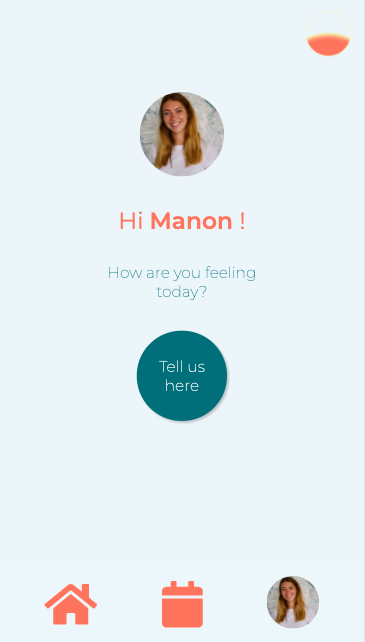
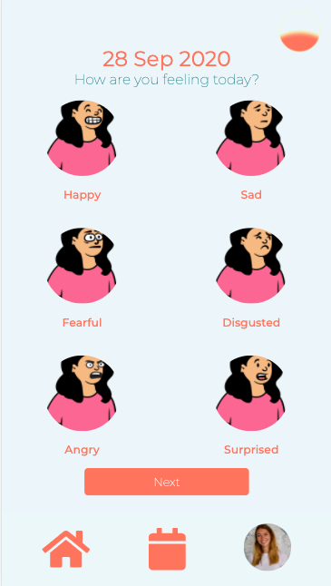
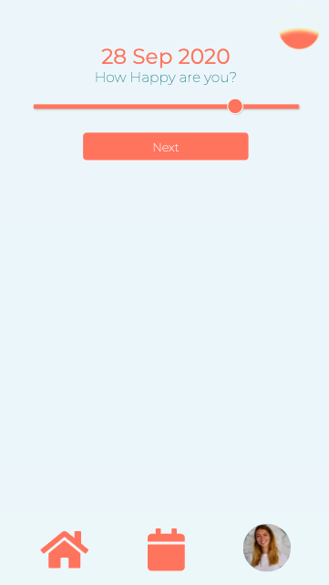
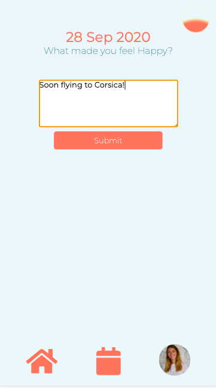
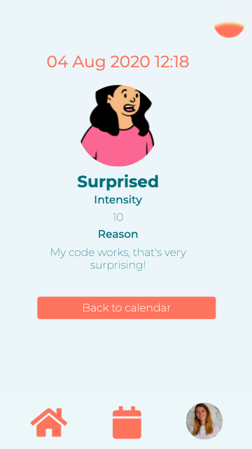
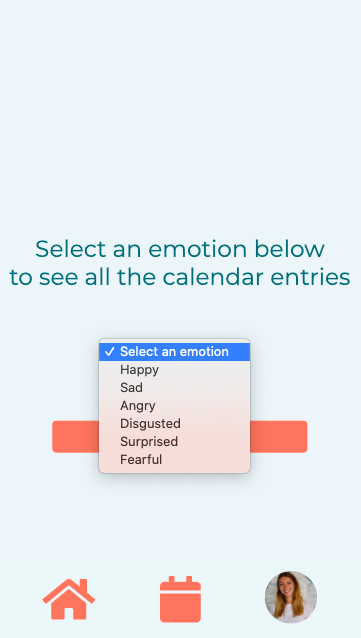
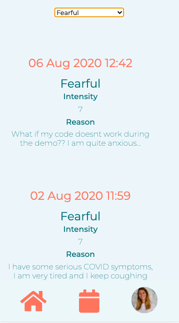
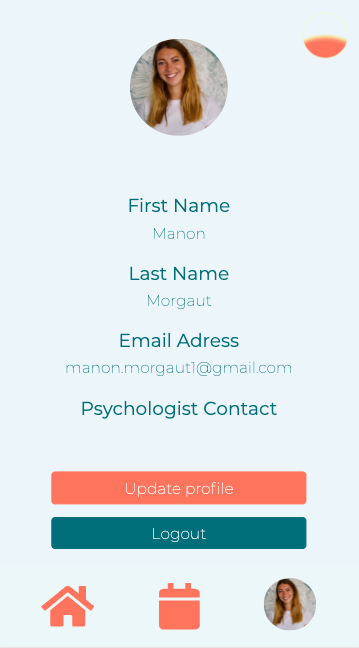

## Introduction

Emotion-tracker is my final project during Ironhack bootcamp in Paris. I wanted to create in a week an emotion-tracking tool with a "mobile first" interface" (so I recommend you to re-size your window to have a better display of the interface).

You can access it here: https://the-today-app.herokuapp.com/

## Screenshots

